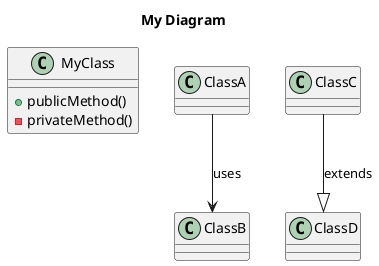

# 📊 UML Διαγράμματα - AI Training App

## Περιεχόμενα

Αυτός ο φάκελος περιέχει **6 UML διαγράμματα** σε **PlantUML format** που τεκμηριώνουν την αρχιτεκτονική της εφαρμογής:

### Διαγράμματα

1. **`class_diagram_chatbot.puml`**
   - **Τύπος**: Class Diagram
   - **Περιγραφή**: Δομή της κλάσης AIKnowledgeBot
   - **Δείχνει**: Attributes, methods, relationships

2. **`sequence_diagram_chatbot.puml`**
   - **Τύπος**: Sequence Diagram
   - **Περιγραφή**: Ροή αλληλεπίδρασης chatbot
   - **Δείχνει**: Χρονική ακολουθία μηνυμάτων

3. **`component_diagram_architecture.puml`**
   - **Τύπος**: Component Diagram
   - **Περιγραφή**: Αρχιτεκτονική συστήματος
   - **Δείχνει**: Layers, modules, dependencies

4. **`activity_diagram_main_flow.puml`**
   - **Τύπος**: Activity Diagram
   - **Περιγραφή**: Ροή κύριας εφαρμογής
   - **Δείχνει**: User journey, decision points

5. **`use_case_diagram.puml`**
   - **Τύπος**: Use Case Diagram
   - **Περιγραφή**: Λειτουργικές απαιτήσεις
   - **Δείχνει**: Actors, use cases, relationships

6. **`deployment_diagram.puml`**
   - **Τύπος**: Deployment Diagram
   - **Περιγραφή**: Αρχιτεκτονική ανάπτυξης
   - **Δείχνει**: Nodes, deployment, infrastructure

## 🔧 Πώς να Προβάλετε τα Διαγράμματα

### Μέθοδος 1: PlantUML Online Server (Εύκολη)

1. Επισκεφτείτε: http://www.plantuml.com/plantuml/uml/
2. Αντιγράψτε το περιεχόμενο ενός `.puml` αρχείου
3. Επικολλήστε στο online editor
4. Το διάγραμμα θα εμφανιστεί αυτόματα

### Μέθοδος 2: Visual Studio Code

1. Εγκαταστήστε το extension: "PlantUML" από jebbs
2. Εγκαταστήστε Java (απαιτείται)
3. Ανοίξτε ένα `.puml` αρχείο
4. Πατήστε `Alt+D` για preview

### Μέθοδος 3: IntelliJ IDEA / PyCharm

1. Ενσωματωμένη υποστήριξη PlantUML
2. Ανοίξτε ένα `.puml` αρχείο
3. Preview panel εμφανίζεται αυτόματα

### Μέθοδος 4: Command Line (για export σε PNG)

```bash
# Εγκατάσταση PlantUML
brew install plantuml  # macOS
# ή
sudo apt-get install plantuml  # Linux

# Generate PNG από .puml
plantuml diagram_name.puml

# Generate όλα τα διαγράμματα
plantuml *.puml
```

### Μέθοδος 5: Python Script

```python
from plantuml import PlantUML

server = PlantUML(url='http://www.plantuml.com/plantuml/img/')
with open('class_diagram_chatbot.puml', 'r') as f:
    diagram = f.read()
    
# Δημιουργία εικόνας
server.processes_file('class_diagram_chatbot.puml')
```

## 📚 Αναφορά PlantUML

### Βασική Σύνταξη



### Χρήσιμοι Σύνδεσμοι

- **Official Documentation**: https://plantuml.com/
- **Language Reference**: https://plantuml.com/guide
- **Class Diagram**: https://plantuml.com/class-diagram
- **Sequence Diagram**: https://plantuml.com/sequence-diagram
- **Component Diagram**: https://plantuml.com/component-diagram
- **Activity Diagram**: https://plantuml.com/activity-diagram-beta
- **Use Case Diagram**: https://plantuml.com/use-case-diagram
- **Deployment Diagram**: https://plantuml.com/deployment-diagram

## 🔄 Συντήρηση Διαγραμμάτων

### Πότε να Ενημερώσετε

- **Class Diagram**: Νέες κλάσεις/μέθοδοι
- **Sequence Diagram**: Αλλαγές στη ροή
- **Component Diagram**: Νέα modules
- **Activity Diagram**: Αλλαγές στο workflow
- **Use Case Diagram**: Νέες λειτουργίες
- **Deployment Diagram**: Αλλαγές στο deployment

### Βήματα Ενημέρωσης

1. Επεξεργαστείτε το `.puml` αρχείο
2. Ελέγξτε το διάγραμμα (preview)
3. Ενημερώστε το `ARCHITECTURE.md` αν χρειάζεται
4. Commit με περιγραφικό message

```bash
git add diagrams/
git commit -m "Update UML diagrams: Add new component"
git push
```

## 📖 Πλήρης Τεκμηρίωση

Για αναλυτική εξήγηση κάθε διαγράμματος, δείτε το **[ARCHITECTURE.md](../ARCHITECTURE.md)**.

## 🎨 Best Practices

### Σχεδιασμός Διαγραμμάτων

1. **Keep it Simple**: Μη συμπεριλαμβάνετε κάθε λεπτομέρεια
2. **Focus**: Κάθε διάγραμμα για συγκεκριμένο σκοπό
3. **Consistent Style**: Χρήση ενιαίου στυλ
4. **Comments**: Προσθέστε σχόλια στο PlantUML code
5. **Notes**: Χρήση notes για εξηγήσεις

### PlantUML Tips

```plantuml
' Σχόλια με apostrophe
!define CONST value  ' Constants

' Χρώματα
class MyClass #lightblue

' Icons (με Unicode)
component "📦 Module" as mod

' Notes
note right of MyClass
  Important information
end note

' Grouping
package "My Package" {
  class A
  class B
}
```

## 🛠️ Troubleshooting

### Δεν εμφανίζεται το διάγραμμα;

1. **Ελέγξτε τη σύνταξη**: Κάθε διάγραμμα πρέπει να ξεκινά με `@startuml` και να τελειώνει με `@enduml`
2. **Java**: Το PlantUML χρειάζεται Java
3. **Graphviz**: Μερικά διαγράμματα χρειάζονται Graphviz

### Αργή εμφάνιση;

- Χρησιμοποιήστε `!pragma layout smetana` για πιο γρήγορο layout
- Μειώστε την πολυπλοκότητα του διαγράμματος

### Export σε διαφορετικά formats

```bash
# PNG (default)
plantuml diagram.puml

# SVG (vector)
plantuml -tsvg diagram.puml

# PDF
plantuml -tpdf diagram.puml

# ASCII art
plantuml -ttxt diagram.puml
```

## 📄 License

Τα διαγράμματα διατίθενται υπό την ίδια άδεια με το project (MIT License).

## 👥 Συνεισφορά

Για βελτιώσεις στα διαγράμματα:

1. Fork το repository
2. Δημιουργήστε feature branch
3. Κάντε τις αλλαγές σας
4. Ελέγξτε τα διαγράμματα
5. Ανοίξτε Pull Request

---

## 🔗 Σχετικά Αρχεία

- **[ARCHITECTURE.md](../ARCHITECTURE.md)** - Πλήρης τεκμηρίωση αρχιτεκτονικής
- **[PROJECT_SUMMARY.md](../PROJECT_SUMMARY.md)** - Σύνοψη project
- **[README.md](../README.md)** - Κύριο README

---

<div align="center">

**Made with ❤️ for Documentation**

*"A picture is worth a thousand words, but a good UML diagram is worth a thousand pictures"*

</div>
